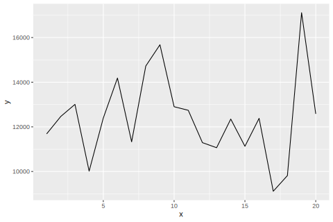
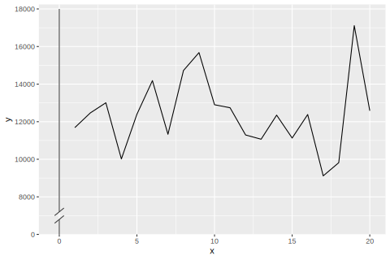
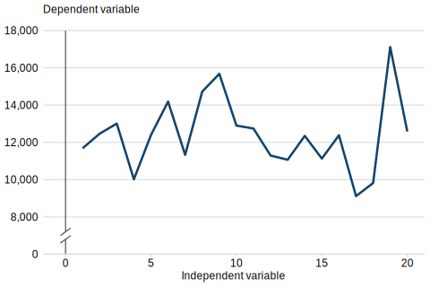

# ggbreak

## Purpose

ggbreak is a one-function R package for adding a [y-axis break symbol](https://commons.wikimedia.org/wiki/File:Y-axis_break.svg) to a chart made using ggplot2.

The package has been developed to support analysts in ensuring their charts comply with [Government Analysis Function data visualisation guidance](https://analysisfunction.civilservice.gov.uk/policy-store/data-visualisation-charts/) on breaking the y-axis.

Current Analysis Function guidance draws the break symbol on in Microsoft PowerPoint. Using `add_break_symbol()` is a reproducible alternative which you can include in your typical data visualisation workflow.

## Installation

ggbreak can be installed directly from the [UKHSA-Collaboration GitHub page](https://github.com/ukhsa-collaboration):

``` r
# install.packages("devtools")
devtools::install_github("UKHSA-Collaboration/ggbreak")
```

## Getting started

Let's start by creating a basic line chart using ggplot2.

### Basic line chart

``` r
library(ggplot2)
library(scales)

df <- data.frame(x = 1:20, y = rnorm(20, mean = 12000, sd = 2000))

p <- ggplot(df, aes(x, y)) +
  geom_line()

p
```



Now, let's add a break symbol to the y-axis.

### Example 1: basic line chart with break symbol

``` r
p + 
  add_break_symbol(p)
```



`add_break_symbol()` can take a range of additional arguments which control the scale of the y-axis and the formatting of the break symbol.

### Example 2: line chart with break symbol and Analysis Function theme

``` r
library(afcharts)

plot_break_af <- ggplot(df, aes(x, y)) +
  geom_line(colour = af_colour_values[1],
            linewidth = 1.2) +
  theme_af(ticks = "x") +
  labs(x = "Independent variable",
       y = NULL,
       subtitle = "Dependent variable")

plot_break_af <- plot_break_af +
  add_break_symbol(plot_break_af, y_fmt = "comma")
```

`add_break_symbol()` works well when used with the afcharts package.



## Acknowledgements

Authors: Analytics and Data Science Directorate, UK Health Security Agency.

## Licence

Unless stated otherwise, the codebase is released under MIT License. This covers both the codebase and any sample code in the documentation.

The documentation is [Crown copyright](https://www.nationalarchives.gov.uk/information-management/re-using-public-sector-information/uk-government-licensing-framework/crown-copyright/) and available under the terms of the [Open Government 3.0 licence](https://www.nationalarchives.gov.uk/doc/open-government-licence/version/3/).
