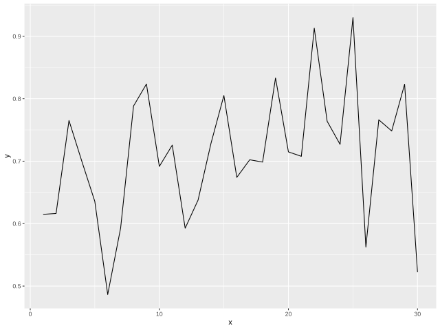
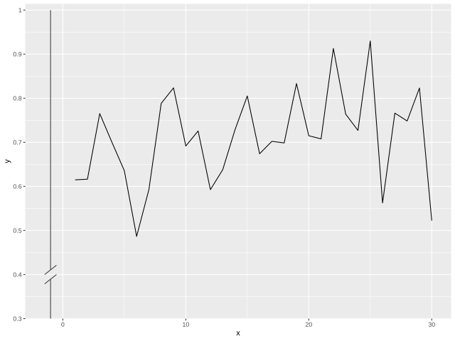
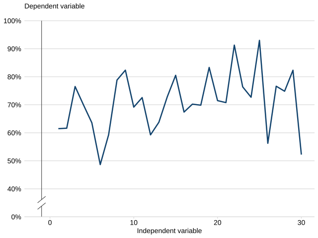

# ggbreak

## Purpose

ggbreak is a one-function R package for adding a [y-axis break symbol](https://commons.wikimedia.org/wiki/File:Y-axis_break.svg) to a line chart made using ggplot2.

> [!IMPORTANT] The function will return an error if any other chart type is supplied.

The package has been developed to support analysts in ensuring their charts comply with [Government Analysis Function data visualisation guidance](https://analysisfunction.civilservice.gov.uk/policy-store/data-visualisation-charts/) on breaking or truncating the numerical axis.

Current Analysis Function guidance recommends drawing the break symbol on charts in Microsoft PowerPoint. Using `add_break_symbol()` is a reproducible alternative which you can include in your typical data visualisation workflow.

> [!CAUTION] The package is currently under development. Please report any bugs as Issues.

## Installation

ggbreak can be installed directly from the [UKHSA-Collaboration GitHub page](https://github.com/ukhsa-collaboration):

``` r
# install.packages("devtools")
devtools::install_github("UKHSA-Collaboration/ggbreak")
```

## Getting started

Let's start by creating a basic line chart using ggplot2.

### Basic line chart with no break symbol

Here, the y-axis does not start at zero or a natural baseline.

``` r
library(ggplot2)
library(scales)

set.seed(666)

df <- data.frame(x = 1:30, y = rnorm(30, mean = 0.7, sd = 0.1))

p <- ggplot(df, aes(x, y)) +
  geom_line()

p
```



Now, let's add a break symbol to the y-axis, specifying the break symbol at y = 0.4.

### Example 1: basic line chart with break symbol

``` r
add_break_symbol(p, break_at = 0.4)
```



`add_break_symbol()` can take a range of additional arguments which control the scale of the y-axis and the formatting of the break symbol.

For this reason, you should not use `scale_y_continuous()` to format your y-axis (for example the breaks, labels, limits) – all formatting of the y-axis is handled by `add_break_symbol()` and must be specified by the user. At minimum, you must provide a gg or ggplot object and a break symbol position (`break_at`) for the function to work.

### Example 2: line chart with break symbol and Analysis Function theme

``` r
library(afcharts)

plot_break_af <- 
  ggplot(df, aes(x, y)) +
  geom_line(colour = af_colour_values[1],
            linewidth = 1.2) +
  theme_af(ticks = "x") +
  labs(x = "Independent variable",
       y = NULL,
       subtitle = "Dependent variable")

add_break_symbol(
  plot_break_af,
  break_at = 0.35,
  y_breaks = seq(0.3, 1, 0.1),
  y_labels = scales::label_percent(),
  y_limits = c(0.3, 1),
  y_origin_override = 0
)
```

`add_break_symbol()` works well when used with the Government Analysis Function's [afcharts package](https://best-practice-and-impact.github.io/afcharts/).



## Acknowledgements

Author:

Head of Profession for Statistics Office Analytical Quality Assurance and Standards Analysis and Intelligence Assessment Chief Data Officer Group UK Health Security Agency

## Licence

Unless stated otherwise, the codebase is released under MIT License. This covers both the codebase and any sample code in the documentation.

The documentation is [Crown copyright](https://www.nationalarchives.gov.uk/information-management/re-using-public-sector-information/uk-government-licensing-framework/crown-copyright/) and available under the terms of the [Open Government 3.0 licence](https://www.nationalarchives.gov.uk/doc/open-government-licence/version/3/).
